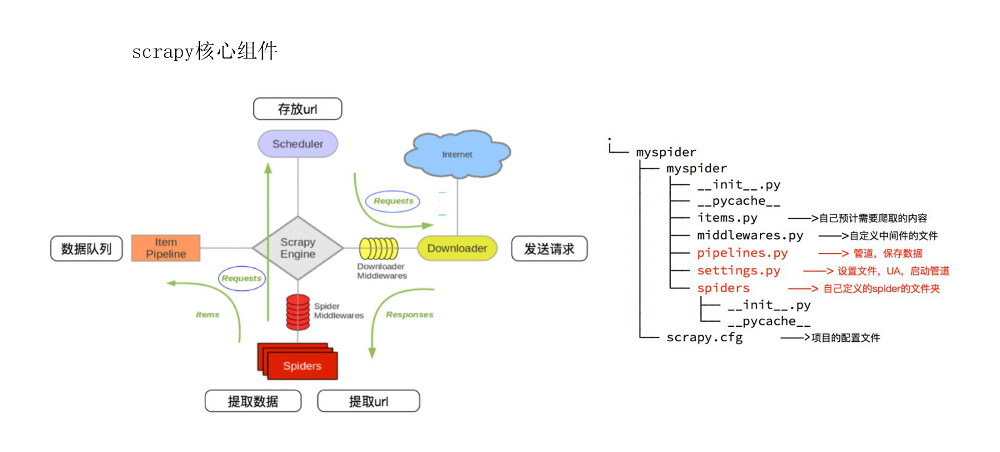

#  20scrapy框架

框架是一套可复用的、半成品的软件架构，它为开发者提供了一套基础结构、设计 模式、工具集合和开发规范，目的是让开发者能更高效、更规范地构建应用程序

scrapy：
    高级技能【封装了大多数功能】。
        异步爬虫、去重、断点续传、分布式.....
            异步爬虫：大。
            分布式：一个电脑能采集的量有限【性能】 =》数据量非常大。
        一般自己接单做爬虫，用不到这些【非必须掌握】。
    找工作：

​		公司比较大，对数据量要求比较大


## 一个基本的scrapy爬虫

1.创建一个新的Scrapy项目： scrapy startproject  项目名

2.创建一个爬虫： （放到 spiders 中）

​	scrapy genspider 爬虫名称（不能跟上面的项目名称重复） 域名

```
scrapy genspider bd https://www.baidu.com/
```

3.编写爬虫逻辑：在爬虫的目录中，可以编辑parse()函数，在其中编写爬取网页 的代码 

4.运行爬虫： scrapy crawl  爬虫名称（不要用右键“run”）（也是 spiders 下运行）


注：所有命令要在对应的位置执行，否则可能会失败。


框架默认是遵守 robots 协议

​	进入setting文件	

​		ROBOTSTXT_OBEY要改为 False


clear可以清空控制台


## 常用配置文件

```
1.BOT_NAME: 项目的名字，用于区分不同的 Scrapy 项目
2.LOG_LEVEL: 日志级别，控制日志的输出程度
	CRITICAL：仅输出最高级别的严重错误消息
	ERROR：输出错误和更严重级别的消息		(一般用这个)
	WARNING：输出警告和更严重级别的消息
	INFO（默认值）：输出常规信息、警告和错误消息
	DEBUG：输出详细的调试信息，包括请求和响应数据
3.USER_AGENT: 请求中的 User-Agent，用于伪装浏览器身份
4.ROBOTSTXT_OBEY: 是否遵守 robots.txt 规则，控制是否爬取被禁止的页面
5.CONCURRENT_REQUESTS: 并发请求数的最大值，用于控制同时发出的请求数量
6.DOWNLOAD_DELAY：请求之间的延迟（防封）
7.ITEM_PIPELINES: 定义数据处理管道的优先级，指定对数据进行处理的模块
8.DEFAULT_REQUEST_HEADERS：请求头设置
9.SPIDER_MIDDLEWARES/DOWNLOADER_MIDDLEWARES：爬虫/下载中间件
10.COOKIES_ENABLED: 是否启用 Cookie 功能，用于处理和发送请求中的 Cookie

```


## 响应对象

项目启动成功后，会自动执行 parse 方法，响应信息会传递给 response 参数， 我们称它为响应对象

| 方法说明                   | requests             | scrapy           |
| -------------------------- | -------------------- | ---------------- |
| 响应的 URL                 | response.url         | response.url     |
| HTTP 状态码                | response.status_code | response.status  |
| 响应的 HTTP 头             | response.headers     | response.headers |
| 响应的内容（字节类型）     | response.content     | response.body    |
| 响应内容（Unicode 字符串） | response.text        | response.text    |
| 将响应内容（JSON 对象）    | response.json()      | response.json()  |


### 数据解析

Scrapy 框架提供了数据解析 API，主要用于从网页内容中提取结构化数据

response.xpath('xpath表达式')：使用 XPath 提取数据。 

element.get()：提取第一个结果的字符串。 

element.getall()：提取所有结果的列表


### 构建请求

```
scrapy.Request(
    url,                   # 请求的URL（必需）
    callback=None,         # 指定处理响应的回调函数（通常是 parse）
	meta=None,             # 传递自定义数据的字典（非常重要！）
    method='GET',          # 请求方法：GET / POST
    headers=None,          # 请求头（字典）
    body=None,             # 请求体（一般用于 POST）
    cookies=None,          # Cookies（字典或字符串）
    dont_filter=False,     # 是否禁用去重（默认 False，即会被去重）
    errback=None,          # 请求失败时的回调函数
    priority=0,            # 请求优先级（数字，越大越优先）
)
```

（填写的是默认值）


## 组件



### 核心组件

引擎 (Engine)：Scrapy引擎负责控制数据流在所有组件之间的流动，并在相应动作发生时触发事件。

调度器 (Scheduler)：调度器负责获取请求并将其排队，以便引擎后续处理。

下载器 (Downloader)：下载器负责获取网页内容。当调度器传递一个请求给下载器时，下载器会下载该请求对应的URL内容。

爬虫 (Spiders)：爬虫是用户自定义的类，用于解析网页内容并提取数据。爬虫通常从一个或多个起始URL开始，然后跟踪网页中的链接以发现更多内容。

项目管道 (Item Pipelines)：管道负责处理爬虫提取的数据。用户可以自定义管道来实现数据的清洗、验证、持久化（即保存）等操作。


## 管道

在 Scrapy 中，Pipeline（管道）是一个用于对爬取到的数据进行后期处理、存储 或清洗的组件

一个Item Pipeline组件就是一个Python类，必须实现 process_item 方法

```
class 管道类:
def process_item(self, item, spider):
return item
```

### 管道使用步骤

定义管道类（处于 pipelines.py 文件中） 

启用管道（处于settings.py文件中）

```
 ITEM_PIPELINES = { 管道类: 优先级（值越小越先执行）, }
```

定义数据项（处于items.py文件中） 

```
字段名称 = scrapy.Field()
```

数据处理

​    spiders item[‘字段名称’] = 数据

​    KeyError: 'BaiduItem does not support field: title'

​    写入到 item 中的 key，必须在 item 类中存在


### 管道方法

```
open_spider(self, spider)：
打开爬虫的时候执行的方法，只执行一次
process_item(self, item, spider)：
每次接收数据都会被调用
close_spider(self, spider)：
结束爬虫的时候只执行一次
```


## 写入数据

### 文本

以MongoDB为例

```
class Top250Pipeline:
    def __init__(self):
        self.client = None
        self.collection = None
    def open_spider(self, spider):
        # 建立连接
        self.client = pymongo.MongoClient("127.0.0.1", 27017)
        self.collection = self.client["douban"]["top250"]

    def process_item(self, item, spider):
        self.collection.insert_one(item)
        return item

    # 关闭爬虫的时候只执行一次
    def close_spider(self, spider):
        # 关闭链接
        self.client.close()
```

注：如果要往 MongoDB 中写入数据，需要在 item 中加上 _id = scrapy.Field()


`self.client = pymongo.MongoClient("127.0.0.1", 27017)`可以放到配置文件里（显得高级一点，方便维护更改）

settings.py :

```
# 自定义配置：MongoDB
MONGO_HOST = "127.0.0.1"
MONGO_PORT = 27017
MONGO_DBNAME = "douban"
MONGO_COLLECTION = "top250"
```

pipeline.py：

```
class Top250Pipeline:

    def __init__(self):
        self.client = None
        self.collection = None
        
    def open_spider(self, spider):
        host = spider.settings.get("MONGO_HOST")
        port = spider.settings.get("MONGO_PORT")
        db_name = spider.settings.get("MONGO_DBNAME")
        collection_name = spider.settings.get("MONGO_COLLECTION")

        self.client = pymongo.MongoClient(host, port)
        self.collection = self.client[db_name][collection_name]

    def process_item(self, item, spider):
        self.collection.insert_one(item)
        return item

    def close_spider(self, spider):
        self.client.close()
        pass

```


### 图片

要用到图片管道类

#### 使用

1.修改配置：

​	开启管道  图片路径：IMAGES_STORE = 图片地址(默认为None)

2.创建管道类

3.继承图片管道类

```
from scrapy.pipelines.images import ImagesPipeline
```

4.重写图片管道类方法

```
获取媒体请求：
def get_media_requests(self, item, info):
文件路径：
def file_path(self, request, response=None, info=None, *, item=None):
处理完成：项目完成之后可以调用的方法
def item_completed(self, results, item, info):

```

`def item_completed(self, results, item, info):`下 print(results) 输出任务结果

```
[(True, {'url': 'https://www.baidu.com/img/PCtm_d9c8750bed0b3c7d089fa7d55720d6cf.png', 'path': 'baidu.png', 'checksum': '099699dac261f776ed1c77b5dd508924', 'status': 'downloaded'})]
```

`True`: 表示图片下载成功。如果下载失败，则这个值会是 `False`

`status`：下载状态。常见值有：

downloaded：成功下载

uptodate：已存在（通过 checksum 判断是重复图片，跳过下载）

None：下载失败（当元组第一个值是 `False` 时出现）


## 功能扩展（在setting中设置）

### 日志

日志是用来记录程序运行过程中的各种信息的一种机制，比如：爬虫启动了、提 取了某个数据、出现了警告或错误、请求失败了、管道存储数据成功或失败。简单 来说，Scrapy 的日志就是用来告诉你“程序干了什么、有没有出错”的工具

日志配置

```
将日志写入到文件
LOG_FILE = 'spider.log' 
设置日志级别
LOG_LEVEL = 'INFO'
日志显示格式
LOG_FORMAT = '%(asctime)s [%(name)s] %(levelname)s: %(message)s'
	asctime：日志时间
	name：日志名称，通常是模块名称
	levelname：日志级别
	message：日志消息
控制时间戳部分的格式
LOG_DATEFORMAT = '%Y-%m-%d %H:%M:%S'

```


### excel 相关

EXCEL_PATH：文件路径及名称

SHEET_NAME：表名

```
EXCEL_PATH = 'douban.xlsx'
SHEET_NAME = 'top250'
```


## 重试

默认情况下，Scrapy 已经会对某些失败的 HTTP 请求进行自动重试，你什么都不用做，它已经在默默帮你处理一部分重试逻辑了

启用重试：RETRY_ENABLED = True

默认已经是 True，可省略。

最多重试次数：RETRY_TIMES = 3

不包括第一次请求，默认是 2，即总共最多 3 次

遇到哪些 HTTP 状态码时重试：RETRY_HTTP_CODES = [500, 502, 503, 504, 408, 429, 403]

超时设置：DOWNLOAD_TIMEOUT = 10

超过 10 秒没响应就超时


